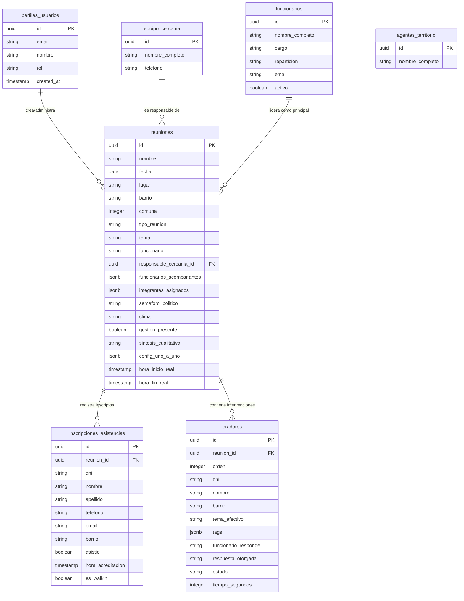

# DOCUMENTO DE REQUISITOS DE SOFTWARE (SRS)
## Sistema de Gestión de Presentismo y Seguimiento Territorial
**Dirección General de Participación Ciudadana — Gobierno de la Ciudad Autónoma de Buenos Aires**

---

### FICHA DEL DOCUMENTO
* **Proyecto:** Sistema de Presentismo y Analítica Territorial (BA Participación Ciudadana)
* **Versión:** 2.0.0
* **Fecha de Emisión:** Agosto 2026
* **Estado:** Especificación Oficial de Requisitos de Software (SRS)
* **Tecnologías Base:** React 19, Vite, Supabase (PostgreSQL / Auth / RLS), Recharts, Lucide React, XLSX.

---

## 1. INTRODUCCIÓN Y OBJETIVOS

### 1.1 Propósito
El presente documento establece los requisitos funcionales y no funcionales para la plataforma de **Gestión de Presentismo y Seguimiento Territorial** de la Dirección General de Participación Ciudadana del Gobierno de la Ciudad de Buenos Aires (GCBA). El sistema permite digitalizar, coordinar y analizar de forma integral la asistencia, moderación y reclamos en los encuentros entre vecinos y funcionarios del gobierno (Reuniones Vecinales, Encuentros 1 a 1 y Foros Comunales).

### 1.2 Objetivos Principales
1. **Acreditación Veloz en Territorio:** Permitir la búsqueda y marcación de asistencia en tiempo real por DNI, Nombre, Celular o Email en dispositivos móviles y computadoras.
2. **Moderación y Registro de Intervenciones:** Controlar la lista de oradores, cronometrar intervenciones, capturar la síntesis cualitativa de cada vecino y registrar las respuestas de los funcionarios.
3. **Clasificación Inteligente de Reclamos:** Categorizar automáticamente las temáticas mediante algoritmos de procesamiento de texto (tagging automático por palabras clave) y permitir etiquetado manual.
4. **Analítica de Negocio (Business Intelligence):** Proveer un centro de informes con KPIs consolidados, tasa de conversión de inscriptos a asistentes, semáforo político, clima de la reunión, rendimiento por funcionario y exportación a Excel.

---

## 2. ALCANCE DEL SISTEMA

```mermaid
graph TD
    A[Sistema de Presentismo y Seguimiento Territorial] --> B[1. Autenticación y RBAC]
    A --> C[2. ABM de Reuniones y Eventos]
    A --> D[3. Control de Asistencia y Puerta]
    A --> E[4. Moderación y Cronómetro]
    A --> F[5. Central de Informes & BI]
    A --> G[6. ABM Funcionarios y Equipos]

    B --> B1[Login con Supabase Auth]
    B --> B2[Asignación de Roles y Permisos]

    C --> C1[Reuniones Vecinales]
    C --> C2[Encuentros 1 a 1]
    C --> C3[Parámetros Políticos y Clima]

    D --> D1[Búsqueda en Vivo por DNI/Nombre]
    D --> D2[Acreditación Express Walk-in]

    E --> E1[Lista Dinámica de Oradores]
    E --> E2[Auto-detección de Tags]
    E --> E3[Cronómetro Multimesa 1 a 1]

    F --> F1[KPIs y Conversión %]
    F --> F2[Nube de Palabras y Lemmatización]
    F --> F3[Filtros Multidimensionales y Exportación XLSX]

    G --> G1[Gestión de Funcionarios y Reparticiones]
    G --> G2[Asignación de Equipo Cercanía y Territorio]
```

---

## 3. ROLES DE USUARIO Y MATRIZ DE PERMISOS (RBAC)

El sistema soporta un esquema estricto de **Control de Acceso Basado en Roles (RBAC)** mediante la tabla `perfiles_usuarios` y políticas de RLS en Supabase:

| Rol | Descripción | Permisos Principales |
| :--- | :--- | :--- |
| **`gerencia`** | Directores, Gerentes y Administradores Generales. | Acceso total al sistema: creación/edición de reuniones, visualización de Central de Informes completa, ABM de Funcionarios, exportaciones a Excel y moderación. |
| **`cercania`** | Coordinadores del Equipo de Cercanía Territorial. | Creación y administración de reuniones asignadas, control de asistencia, moderación en vivo, consulta de estadísticas territoriales y exportación. |
| **`asistencia`** | Acreditadores en puerta y personal operativo de entrada. | Acceso exclusivo/simplificado a la búsqueda e inscriptos/walk-ins de la reunión asignada para marcar `asistio = true/false`. |
| **`moderador`** | Cronometristas y moderadores del evento. | Manejo del panel de orden de oradores, toma de tiempos, carga de síntesis cualitativa, tagging de temáticas y panel 1 a 1. |
| **`funcionario`** | Funcionarios invitados u oradores principales. | Consulta de sus propias estadísticas (rendimiento, reuniones lideradas, temáticas más consultadas) e historial de participación. |

---

## 4. REQUISITOS FUNCIONALES (RF)

### MÓDULO 1: AUTENTICACIÓN Y GESTIÓN DE SESIÓN

#### **RF-01: Autenticación de Usuarios (Login)**
* **Descripción:** El usuario debe iniciar sesión con su correo electrónico y contraseña registrados en Supabase Auth.
* **Criterio de Aceptación:** Si las credenciales son válidas, se cruza el UUID con la tabla `perfiles_usuarios` para cargar el rol y nombre completo. Si la fila en `perfiles_usuarios` no existe, el sistema la crea automáticamente con rol por defecto `gerencia` o `asistencia`.
* **Seguridad:** Tokens JWT administrados por Supabase. Las contraseñas nunca se almacenan en texto plano.

#### **RF-02: Recuperación de Contraseña**
* **Descripción:** El sistema debe ofrecer un enlace de recuperación de clave enviando un email de restablecimiento seguro.

#### **RF-03: Persistencia de Sesión y Multi-Pestaña**
* **Descripción:** La sesión del usuario debe ser tolerante al refresco de pantalla ($F5$) y admitir la apertura simultánea de módulos en pestañas separadas del navegador vía parámetros de URL (`view`, `reunion_id`, `modal`).

---

### MÓDULO 2: ABM DE REUNIONES Y CONFIGURACIÓN DE EVENTOS

#### **RF-04: Alta y Edición de Reuniones**
* **Descripción:** El usuario con rol `gerencia` o `cercania` debe poder crear y modificar los parámetros de una reunión vecinal o evento territorial.
* **Campos obligatorios / opcionales:**
  * Nombre del Evento / Título.
  * Fecha, Hora de Inicio Estimada y Hora de Fin Estimada.
  * Comuna (1 a 15) y Barrio oficial de CABA.
  * Lugar / Dirección del encuentro.
  * Tipo de Reunión: *Reunión Vecinal*, *Uno a Uno*, *Mesa Barrial*, *Foro Comunal*.
  * Tema principal del encuentro.
  * Funcionario Principal asignado y Funcionarios Acompañantes.
  * Responsable del Equipo de Cercanía (con vínculo a `equipo_cercania`).
  * Integrantes del Equipo de Territorio asignados (`agentes_territorio`).
  * Observaciones de preparación y logística.

#### **RF-05: Parámetros Especiales para Encuentros "Uno a Uno"**
* **Descripción:** En caso de seleccionar el tipo de reunión *Uno a Uno*, el sistema debe permitir configurar la estructura multimesa:
  * Cantidad de Mesas / Estaciones simultáneas de atención.
  * Tiempo máximo recomendado por vecino (ej. 3, 5, 7 u 10 minutos).
  * Intervalo entre turnos.

#### **RF-06: Indicadores Políticos y Clima del Encuentro (Post-Reunión)**
* **Descripción:** Permitir registrar una evaluación cualitativa y política del encuentro finalizado:
  * **Semáforo Político:** *Verde* (Favorable/Positivo), *Amarillo* (Neutral/Mixto), *Rojo* (Conflictivo/Tenso).
  * **Clima del Encuentro:** *Muy Bueno*, *Bueno*, *Tenso*, *Conflictivo*.
  * **Gestión Presente:** Marca de presencia del equipo directivo.
  * **Síntesis Cualitativa General:** Resumen de principales reclamos o hitos de la reunión.

---

### MÓDULO 3: CONTROL DE ASISTENCIA Y ACREDITACIÓN EN VIVO (PUERTA)

#### **RF-07: Búsqueda y Acreditación Veloz**
* **Descripción:** El personal de puerta debe poder buscar a un vecino inscripto escribiendo su DNI, Nombre, Apellido, Celular o Email.
* **Criterio de Aceptación:** La búsqueda debe ser instantánea ($< 200\text{ ms}$) filtrando en memoria o vía consulta indexada.
* **Acción:** Al presionar un botón toggle o switch, se marca el campo `asistio = true` o `asistio = false` y la hora exacta de acreditación (`hora_acreditacion`), reflejándose en tiempo real en la base de datos.

#### **RF-08: Acreditación Express de Vecinos No Inscriptos (Walk-Ins)**
* **Descripción:** Permite dar de alta y acreditar inmediatamente a vecinos que acuden al evento sin inscripción previa.
* **Campos capturados:** DNI (único), Nombre, Apellido, Teléfono, Email, Barrio de residencia.
* **Efecto:** Inserta el registro en `inscripciones_asistencias` vinculado a la `reunion_id` activa con `asistio = true` y marca de `es_walkin = true`.

#### **RF-09: Contador de Asistencia en Tiempo Real**
* **Descripción:** La pantalla de acreditación debe mostrar indicadores en directo:
  * Total Inscriptos (Convocados).
  * Total Asistentes Acreditados.
  * Total Ausentes.
  * Porcentaje de Conversión de Asistencia en vivo ($\% = \frac{\text{Asistentes}}{\text{Inscriptos}} \times 100$).

---

### MÓDULO 4: MODERACIÓN, LISTA DE ORADORES Y CRONÓMETRO

#### **RF-10: Gestión de Lista de Oradores (Reuniones Vecinales)**
* **Descripción:** El moderador debe administrar el orden de intervención de los vecinos anotados para hablar.
* **Funcionalidades:**
  * Reordenar oradores (subir/bajar turno o drag & drop).
  * Cambiar estado del orador: *En Espera*, *Hablando*, *Finalizado*, *Ausente*.
  * Visualizar el orador activo destacado en pantalla.

#### **RF-11: Minuta Cualitativa y Respuestas por Orador**
* **Descripción:** Durante o después de la intervención de cada orador, el moderador registra:
  * **Consulta / Reclamo:** Síntesis escrita de la exposición del vecino.
  * **Funcionario que Responde:** Selección del funcionario que toma la palabra.
  * **Respuesta Otorgada:** Compromiso o contestación brindada por el gobierno.

#### **RF-12: Etiquetado de Temáticas (Tagging Manual y Auto-Detección Algorítmica)**
* **Descripción:** Clasificación temáticas de las intervenciones.
* **Categorías de Tags Predefinidos:**
  1. *Tránsito y Movilidad*
  2. *Seguridad*
  3. *Higiene Urbana*
  4. *Situación de Calle*
  5. *Espacio Público y Veredas*
  6. *Arbolado y Parques*
  7. *Infraestructura y Obras*
  8. *Eventos, Fiestas y Ruidos*
  9. *Salud*
  10. *Educación*
  11. *Comercio e Impuestos*
  12. *Mascotas*
  13. *Trámites y Servicios GCBA*
  14. *Desarrollo Social*
* **Auto-detección Inteligente:** Al escribir la minuta del orador, el sistema ejecuta un algoritmo matcher que analiza palabras clave en el texto y propone automáticamente los tags correspondientes cuando detecta 2 o más coincidencias asociadas a una categoría.

#### **RF-13: Módulo Cronómetro "1 a 1" (Multimesa)**
* **Descripción:** Panel especial para gestionar reuniones estructuradas en mesas de atención individual.
* **Funciones:**
  * Control de tiempo por estación/mesa con temporizador regresivo visual.
  * Indicadores de alerta de tiempo por vencer (cambio de color de verde a amarillo/rojo y señal acústica opcional).
  * Botones de "Siguiente Vecino", "Pausar", "Reiniciar".

---

### MÓDULO 5: CENTRAL DE INFORMES Y ANALÍTICA DE NEGOCIO (BI)

#### **RF-14: Tablero de KPIs Consolidados**
* **Descripción:** Presenta las métricas macro de la gestión territorial en el rango de fechas seleccionado:
  * Total de Reuniones Realizadas.
  * Total de Vecinos Convocados (Inscriptos).
  * Total de Vecinos Asistentes.
  * Tasa de Conversión General ($\%$).
  * Total de Oradores e Intervenciones Registradas.

#### **RF-15: Comparativa Temporal con Período Anterior**
* **Descripción:** El sistema calcula automáticamente las métricas del período equivalente inmediatamente anterior y muestra la variación porcentual ($\Delta\%$) con insignias visuales (flechas de incremento o decremento).

#### **RF-16: Análisis Temático por Nube de Palabras y Lemmatización**
* **Descripción:** Extrae los conceptos más repetidos en las minutas de los vecinos procesando el texto mediante:
  * Eliminación de *Stopwords* (conectores, artículos y pronombres en español).
  * Lemmatización/Normalización de plurales y variaciones gramaticales (ej. *"veredas"* $\rightarrow$ *"vereda"*, *"autos"* $\rightarrow$ *"auto"*).
  * Ranking interactivo y mapa conceptual de reclamos por comuna o barrio.

#### **RF-17: Estadísticas por Funcionario**
* **Descripción:** Evaluación del desempeño y presencia institucional de cada funcionario del gobierno:
  * Cantidad de reuniones encabezadas.
  * Convocados y Asistentes acumulados en sus eventos.
  * Tasa de conversión promedio.
  * Top de temáticas y reclamos atendidos en sus reuniones.

#### **RF-18: Filtros Multidimensionales Avanzados**
* **Descripción:** Permite filtrar toda la analítica combinando simultáneamente:
  * Rango de fechas (Desde / Hasta).
  * Comuna (1 a 15).
  * Barrio específico.
  * Tipo de Reunión.
  * Funcionario Principal.
  * Búsqueda por palabra clave o texto libre.

#### **RF-19: Exportación de Datos a Excel (XLSX)**
* **Descripción:** Descarga de reportes completos formateados en Excel estructurado con hojas separadas para:
  1. *Resumen de Reuniones* (metadata, semáforo, clima, convocados, asistentes, conversión).
  2. *Detalle de Asistencia* (inscriptos, DNI, presentismo, horario).
  3. *Minuta de Oradores* (temas, tags, funcionario, respuestas).

---

### MÓDULO 6: ABM DE FUNCIONARIOS Y EQUIPOS TERRITORIALES

#### **RF-20: Catálogo de Funcionarios Públicos**
* **Descripción:** Creación, edición y baja lógica de funcionarios de la Ciudad (Ministros, Secretarios, Subsecretarios, Directores, Comisionados).
* **Campos:** Nombre Completo, Cargo, Ministerio/Repartición, Email, Teléfono, Foto/Avatar URL, Estado Activo.

#### **RF-21: Catálogo de Equipo de Cercanía y Agentes de Territorio**
* **Descripción:** Administración de los listados de coordinadores (`equipo_cercania`) y agentes de campo (`agentes_territorio`) asignables a los eventos.

---

## 5. REQUISITOS NO FUNCIONALES (RNF)

### RNF-01: Rendimiento y Tiempos de Respuesta
* **Carga de Pantalla:** Las vistas del Dashboard y Control de Asistencia deben cargar en menos de 1.5 segundos.
* **Acreditación en Vivo:** La marcación de asistencia de un vecino debe procesarse y guardarse en base de datos en menos de 300 ms.
* **Caché en Memoria:** El sistema debe utilizar una capa de caché de sesión (`cachedQuery`) con TTL de 5 minutos para catálogos estáticos (`equipo_cercania`, `agentes_territorio`, `funcionarios`) para minimizar llamadas innecesarias a la base de datos y consumo de ancho de banda (*egress*).

### RNF-02: Seguridad y Protección de Datos
* **Políticas de Seguridad en Base de Datos (RLS):** Todas las tablas en Supabase deben implementar políticas de *Row Level Security* que restrinjan las operaciones de lectura, inserción y actualización según el rol autenticado.
* **Encriptación de Comunicaciones:** Todo el tráfico entre cliente web y Supabase debe viajar obligatoriamente encriptado mediante HTTPS / TLS 1.3.

### RNF-03: Usabilidad y Diseño de Interfaz (UX/UI)
* **Estética Premium:** La interfaz debe respetar la identidad corporativa de Participación Ciudadana (paleta de colores oficial CABA, modo oscuro/claro contrastado, tipografía legible y componentes interactivos con micro-animaciones).
* **Diseño Adaptativo (Responsive):** La plataforma debe ser plenamente operacional en dispositivos móviles (smartphones Android/iOS), tablets y computadoras de escritorio.

### RNF-04: Disponibilidad y Resiliencia
* **Tolerancia a Extensiones del Navegador (Polyfill DOM):** El sistema debe incluir protección global contra errores de manipulación del DOM causados por traductores automáticos (ej. Google Translate) o extensiones mediante la interceptación segura de los métodos `Node.prototype.removeChild` y `Node.prototype.insertBefore`.
* **Manejo de Errores (Error Boundaries):** En caso de un fallo inesperado en algún componente de React, un componente *ErrorBoundary* debe capturar la excepción, evitar el colapso de la app y ofrecer opciones de reintento o regreso al Login.

---

## 6. MODELO DE DATOS Y ENTIDADES (SUPABASE / POSTGRESQL)

---

## 7. REGLAS DE NEGOCIO (RN)

* **RN-01 (Tasa de Conversión):** Se define como el cociente entre vecinos asistentes que efectivamente acudieron al evento y el total de vecinos inscriptos:
  $$\text{Tasa de Conversión (\%)} = \left( \frac{\text{Asistentes Acreditados}}{\text{Total Convocados Inscriptos}} \right) \times 100$$
* **RN-02 (Período Anterior Comparativo):** Al seleccionar un rango de fechas de $N$ días entre $F_{\text{desde}}$ y $F_{\text{hasta}}$, el período anterior abarca exactamente los $N$ días previos finalizando en $F_{\text{desde}} - 1 \text{ día}$.
* **RN-03 (Auto-Tagging por Umbral):** Se asigna de forma automática una etiqueta temática a un orador si el texto de su minuta contiene 2 o más palabras clave asociadas a esa categoría temática en el diccionario `TAG_KEYWORD_MAP`.
* **RN-04 (Límite de Consultas Históricas):** Para optimizar el tráfico de datos, las consultas por defecto traen reuniones de los últimos 180 días, salvo que el usuario active explícitamente el modo *Histórico Completo*.

---

## 8. INFRAESTRUCTURA Y DESPLIEGUE

* **Frontend Build & Pipeline:** Compilación optimizada mediante Vite 8+, empaquetando Javascript ESModule con soporte para navegadores modernos.
* **Base de Datos & Backend Serverless:** Instancia PostgreSQL en Supabase Cloud con conexión SSL y motor de Autenticación integrado.
* **Hosting:** Servidor de despliegue continuo en Netlify / Vercel con reglas de reescritura para Single Page Application (SPA).

---

> **Documento confeccionado y validado para el equipo de desarrollo y coordinación operativa de Participación Ciudadana (GCBA).**
